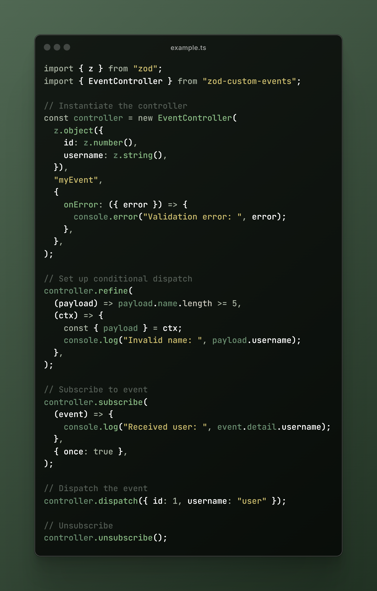

<div align="center">

# Zod Custom Events

Type safe, framework agnostic, Zod based, custom events extension library.

[](https://www.npmjs.com/package/zod-custom-events)
[](https://jsr.io/@georgecht/zod-custom-events)
[](https://jsr.io/@georgecht/zod-custom-events)
[](https://github.com/georgecht/zod-custom-events/actions/workflows/release.yml)
[](https://codecov.io/github/GeorgeCht/zod-custom-events)
[](https://biomejs.dev)

[](http://commitizen.github.io/cz-cli/)
[](https://github.com/georgecht/zod-custom-events/blob/master/LICENSE)

[](https://www.npmjs.org/package/zod-custom-events)

</div>


- ✅ Utilize the full controll of [`CustomEvents`](https://developer.mozilla.org/en-US/docs/Web/API/CustomEvent) with a custom API
- ✅ End-to-end type safety; validate event payload at runtime via your provided [`Zod`](https://github.com/colinhacks/zod) schema
- ✅ Framework agnostic; runs on any `JavaScript` environment
- ✅ Supports all [`CustomEvent`](https://developer.mozilla.org/en-US/docs/Web/API/CustomEvent) native properties and methods inherited by the [`Event`](https://developer.mozilla.org/en-US/docs/Web/API/Event) interface
- ✅ Middleware support for event processing
- ✅ Less than __1kb__ minified and gzipped

## Table of Contents

* [Installation](#installation)
  * [Prerequisites](#prerequisites)
  * [Using NPM](#using-npm)
  * [Using JSR](#using-jsr)
  * [Using a CDN](#using-a-cdn)
* [Usage](#usage)
* [API Reference](#api-reference)
  * [EventController](#eventcontroller)
* [Contributing](#contributing)
* [License](#license)

## Preview



## Installation

### Prerequisites

- [Zod](https://github.com/colinhacks/zod)

Install zod-custom-events using your favorite package manager or CDN, then include it in your project:

### Using NPM

```bash
# Install with npm
npm install zod-custom-events

# Install with pnpm
pnpm add zod-custom-events

# Install with yarn
yarn add zod-custom-events

# Install with bun
bun add zod-custom-events
```

### Using JSR

```bash
# Install in a node project
npx jsr add @georgecht/zod-custom-events

# Install in a deno project
deno add jsr:@georgecht/zod-custom-events

# Install in a bun project
bunx jsr add @georgecht/zod-custom-events
```

### Using a CDN

```html
<!-- Via jsdelivr -->
<script src="https://cdn.jsdelivr.net/npm/zod-custom-events@latest/dist/index.min.js"></script>

<!-- Via unpkg -->
<script src="https://www.unpkg.com/zod-custom-events/dist/index.min.js"></script>
```

## Usage

Here's a basic example of how to use zod-custom-events:

```typescript
import { z } from 'zod';
import { EventController } from 'zod-custom-events';

// Define your event schema
const userSchema = z.object({
  id: z.number(),
  email: z.email(),
});

// Create an event controller
const userEventController = new EventController(userSchema, 'user-event');

// Subscribe to the event
userEventController.subscribe((event) => {
  console.log('Received user event:', event.detail);
});

// Dispatch an event
userEventController.dispatch({
  id: 123,
  email: 'my@email.com',
});

// Cleanup
userEventController.unsubscribe();
```

## API Reference

The API reference is available on [GitHub](https://github.com/GeorgeCht/zod-custom-events/blob/main/README.md#api-reference).

### EventController

The main class for managing custom events. The `EventController<T extends ZodSchema>` extends the `CustomEvent` interface with a `detail` property of type `T`. Meaning it will match the [`CustomEvent`](https://developer.mozilla.org/en-US/docs/Web/API/CustomEvent) interface and infer all the functionality.

---

#### 👉 Constructor

```typescript
constructor(schema: T, eventName: string, options?: EventControllerOptions<T>)
```

Creates a new `EventController` instance.

##### Parameters

- `schema` - The Zod schema for validating the event payload.
- `eventName` - The name of the custom event.
- `options` <span style="font-size: 0.833rem; border: 1px solid; border-radius: 4rem; padding: .125rem .375rem;">optional</span> - Configuration options for the `EventController`.

##### Example

```typescript
import { z } from 'zod';
import { EventController } from 'zod-custom-events';

const schema = z.object({
  name: z.string(),
});

const controller = new EventController(schema, 'myEvent', {
  onError: ({ error }) => console.error('Validation error:', error),
  onDispatch: ({ payload }) => console.log('Dispatching event with payload:', payload),
});
```

##### Available options

- `element` <span style="font-size: 0.833rem; border: 1px solid; border-radius: 4rem; padding: .125rem .375rem;">optional</span> - The element to bind the event to. Defaults to `window`.
- `onError` <span style="font-size: 0.833rem; border: 1px solid; border-radius: 4rem; padding: .125rem .375rem;">optional</span> - Error handler for validation errors.
- `onDispatch` <span style="font-size: 0.833rem; border: 1px solid; border-radius: 4rem; padding: .125rem .375rem;">optional</span> - Callback function called before dispatching the event.
- `onSubscribe` <span style="font-size: 0.833rem; border: 1px solid; border-radius: 4rem; padding: .125rem .375rem;">optional</span> - Callback function called when the event listener is added.
- `onUnsubscribe` <span style="font-size: 0.833rem; border: 1px solid; border-radius: 4rem; padding: .125rem .375rem;">optional</span> - Callback function called when the event listener is removed.

---

#### 👉 Subscribe

Subscribe to the event.

```typescript
subscribe(listener: (event: TypedCustomEvent<EventPayload<T>>) => void, options?: AddEventListenerOptions): void
```

##### Parameters

- `listener` - The function to be called when the event is triggered.
- `options` - Optional parameters for the event listener.

##### Available options

- `once` <span style="font-size: 0.833rem; border: 1px solid; border-radius: 4rem; padding: .125rem .375rem;">optional</span> - A boolean value indicating that the `listener` should be invoked at most [`once`](https://developer.mozilla.org/en-US/docs/Web/API/EventTarget/addEventListener#once) after being added. If `true`, the `listener` would be automatically removed when invoked.
- `passive` <span style="font-size: 0.833rem; border: 1px solid; border-radius: 4rem; padding: .125rem .375rem;">optional</span> - A boolean indicating whether the event listener is a [`passive`](https://developer.mozilla.org/en-US/docs/Web/API/EventTarget/addEventListener#passive) listener. If set to `true`, indicates that the function specified by listener will never call [`preventDefault()`](https://developer.mozilla.org/en-US/docs/Web/API/Event/preventDefault). If a passive listener calls `preventDefault()`, nothing will happen and a console warning may be generated.
- `signal` <span style="font-size: 0.833rem; border: 1px solid; border-radius: 4rem; padding: .125rem .375rem;">optional</span> - An [`AbortSignal`](https://developer.mozilla.org/en-US/docs/Web/API/AbortSignal) to signal when the listener should be removed.

##### Simple example

```typescript
controller.subscribe((event) => {
  console.log('Received user event:', event.detail);
});
```

##### Example with abort signal and once option

```typescript
// With abort signal and once option
const abortController = new AbortController();
const { signal } = abortController;

controller.subscribe((event) => {
  console.log('Received user event:', event.detail);
}, { signal, once: true });

// Later in the code
abortController.abort();
```

---

#### 👉 Unsubscribe

Removes the previously registered event listener for the event.

```typescript
unsubscribe(options?: EventListenerOptions): void
```

##### Parameters

- `options` <span style="font-size: 0.833rem; border: 1px solid; border-radius: 4rem; padding: .125rem .375rem;">optional</span> - Optional parameters to match the event listener.

##### Available options
- `capture` <span style="font-size: 0.833rem; border: 1px solid; border-radius: 4rem; padding: .125rem .375rem;">optional</span> - A boolean value indicating that events of this type will be dispatched to the registered `listener` before being dispatched to any `EventTarget` beneath it in the DOM tree.

##### Example

```typescript
controller.unsubscribe();
```

---

#### 👉 Dispatch

Dispatches the event, validating its payload using the Zod schema and applying middleware.

```typescript
dispatch(payload: EventPayload<T>, eventInitDict?: CustomEventInit<EventPayload<T>>): Promise<void>
```

##### Parameters

- `payload` - The data associated with the event. Validated against the `Zod` schema initially provided.
- `eventInitDict` <span style="font-size: 0.833rem; border: 1px solid; border-radius: 4rem; padding: .125rem .375rem;">optional</span> - Optional parameters for initializing the event.

##### Available `eventInitDict` options

- `bubbles` <span style="font-size: 0.833rem; border: 1px solid; border-radius: 4rem; padding: .125rem .375rem;">optional</span> - A boolean value indicating whether or not the event can bubble through the DOM.
- `cancelable` <span style="font-size: 0.833rem; border: 1px solid; border-radius: 4rem; padding: .125rem .375rem;">optional</span> - A boolean value indicating whether the event can be cancelled.
- `composed` <span style="font-size: 0.833rem; border: 1px solid; border-radius: 4rem; padding: .125rem .375rem;">optional</span> - A boolean value indicating whether the event will trigger listeners outside of a shadow root (see [`Event.composed`](https://developer.mozilla.org/en-US/docs/Web/API/Event/composed) for more details).

##### Example

```typescript
controller.dispatch({
  id: 1,
  name: 'John Doe',
}, {
  bubbles: true
});
```

---

#### 👉 Refine

Sets a condition for the event, allowing control over whether the event is dispatched.

```typescript
refine(condition: (payload: EventPayload<T>) => boolean, callback?: (ctx: EventPayloadContext<T>) => void): void
```

##### Parameters

- `condition` - A function that takes the event payload as input and returns a boolean.
- `callback` <span style="font-size: 0.833rem; border: 1px solid; border-radius: 4rem; padding: .125rem .375rem;">optional</span> - An optional callback function to be called when the condition is not met.

##### Example

```typescript
controller.refine(
  (payload) => payload.id > 0,
  (ctx) => {
    const { payload } = ctx;
    console.log("Invalid user ID:", payload.id)
  }
);
```

---

#### 👉 Update

Updates the `EventController` options.

```typescript
update(options: Partial<EventControllerOptions<T>>): void
```

##### Parameters

- `options` <span style="font-size: 0.833rem; border: 1px solid; border-radius: 4rem; padding: .125rem .375rem;">optional</span> - New configuration options for the `EventController`.

##### Example

```typescript
const controller = new EventController(schema, 'myEvent');

// Later in the code
controller.update({
  onError: ({ error }) => console.warn('New error handler:', error),
  onDispatch: ({ payload }) => console.log('New dispatch handler:', payload),
});
```

---

#### 👉 Use

Adds a middleware function to the event processing pipeline.

```typescript
use(middleware: Middleware<EventPayload<T>>): void
```

##### Parameters

- `middleware` - A function that processes the event context and calls the next middleware.

##### Example

```typescript
controller.use(async (ctx, next) => {
  console.log("Processing user event:", ctx.payload);
  await next();
});
```

## Contributing

Contributions are welcome! Please open an issue or submit a pull request.

## License

This project is licensed under the MIT License. See the [LICENSE](LICENSE) file for more details.